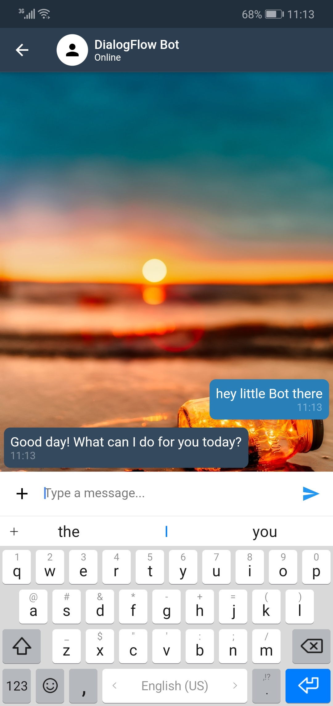
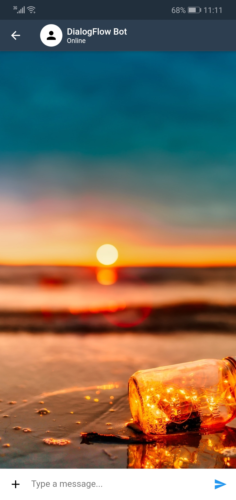
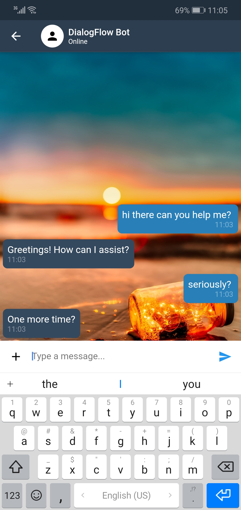

# DialogFlow Bot Flutter [Test App Only]

Basically this is a simple app shows you how to deal with DialogFlow APIs built by Flutter with customized UI (TESTS ONLY).

## Things you must consider:
- First you must get the API key of your agent that you create from Google Service Account  
See <a href="https://dialogflow.com/docs/reference/v2-auth-setup"> Setting up authentication </a>. 
- This app uses the <a href="https://pub.dev/packages/flutter_dialogflow"> Dialogflow v1 & v2 Package </a>for handling the API's requests, responses and so on. 
- Also uses the <a href="https://pub.dev/packages/intl"> intl Packege <a/> for internationalization and localization facilities. 

## Preview
Here's some screenshots after quick tests on Android 9.0
 

  
  
  

